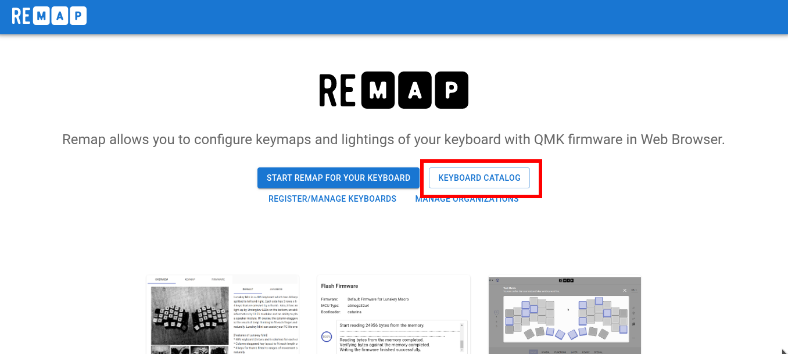
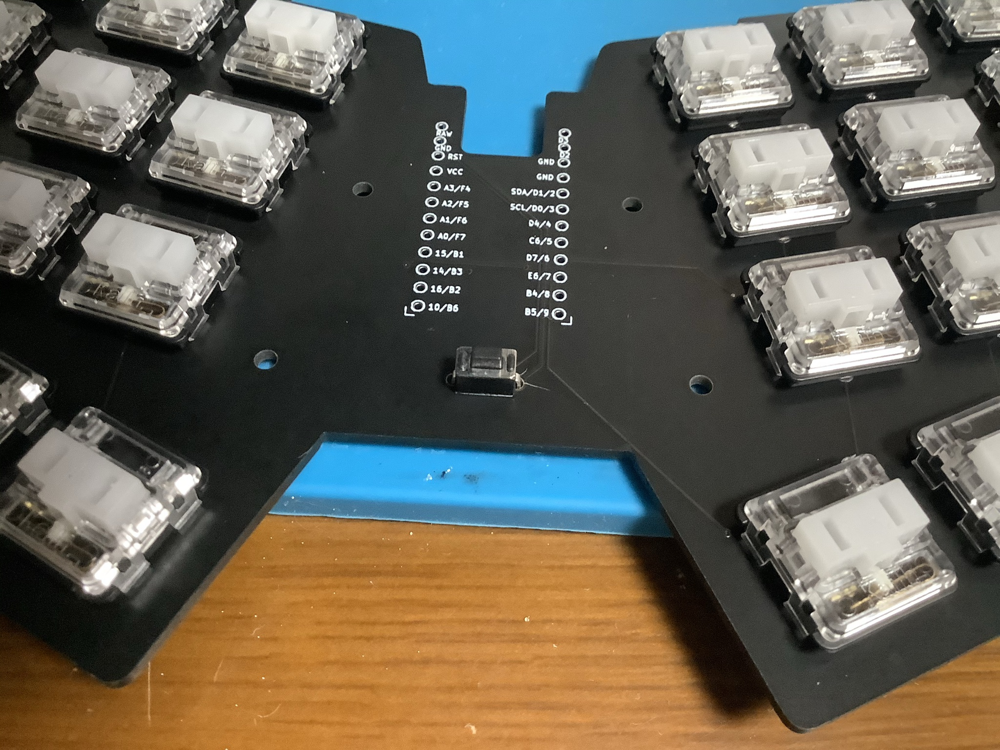
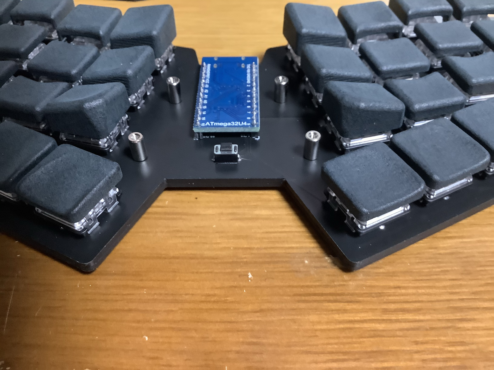

# nowt36lp ビルドガイド

nowt36lp rev0.1 のビルドガイドです。

目次

<!-- vim-markdown-toc GFM -->

* [キットに含まれるもの](#キットに含まれるもの)
* [キット以外に必要なもの](#キット以外に必要なもの)
* [組み立て順序の確認](#組み立て順序の確認)
* [組み立て](#組み立て)
  * [1. ファームウェアの書き込み](#1-ファームウェアの書き込み)
    * [Remap で書き込む場合](#remap-で書き込む場合)
  * [2. (オプション) プレートの側面をペンで塗る](#2-オプション-プレートの側面をペンで塗る)
  * [3. ダイオードのはんだ付け](#3-ダイオードのはんだ付け)
  * [4. スイッチのはんだ付け](#4-スイッチのはんだ付け)
  * [5. リセットスイッチのはんだ付け](#5-リセットスイッチのはんだ付け)
  * [6. ボトムプレートを取り付ける](#6-ボトムプレートを取り付ける)
  * [7. ProMicro保護プレートを取り付ける](#7-promicro保護プレートを取り付ける)
  * [8. ゴム足を取り付ける](#8-ゴム足を取り付ける)
  * [9. キーキャップを取り付ける](#9-キーキャップを取り付ける)
  * [10.キーマップを変更する](#10キーマップを変更する)
* [最後に](#最後に)

<!-- vim-markdown-toc -->

## キットに含まれるもの

| No. | 名前                  | 数量        | 備考                                                                                                                                                                        |
|-----|-----------------------|-------------|-----------------------------------------------------------------------------------------------------------------------------------------------------------------------------|
| 1   | PCB                   | 1枚         | メインPCB                                                                                                                                                                   |
| 2   | ボトムプレート        | 1枚         | ボトムアクリルプレート                                                                                                                                                      |
| 3   | ProMicro 保護プレート | 1枚         | ProMicro 保護プレート。                                                                                                                                                     |
| 4   | リセットスイッチ      | 1個         | タクトスイッチ。 [遊舎工房](https://shop.yushakobo.jp/collections/all-keyboard-parts/products/a0800ts-01-1?variant=37665574977697)で購入できます。                       |
| 5   | ダイオード            | 36個 + 予備 | [遊舎工房](https://shop.yushakobo.jp/collections/all-keyboard-parts/products/a0800di-02-100)で購入できます。                                                                |
| 6   | M2 スペーサー 8mm     | 4個         | ProMicro保護プレートとボトムプレートを固定するためのスペーサー。 [ヒロスギネット](https://www.hirosugi-net.co.jp/shop/c/c10141012/)で購入できます。                      |
| 7   | M2 ねじ 5mm           | 8個         | スペーサーを固定するネジ。 [モノタロウ](https://www.monotaro.com/p/4307/6774/)で購入できます。                                                                           |
| 8   | ゴム足                | 10個        | すべり止め用のゴム足。 [Amazon](https://www.amazon.co.jp/gp/product/B01B4COI8W/ref=ppx_yo_dt_b_asin_title_o07_s00?ie=UTF8&psc=1)で購入できます。                         |
| 9   | 両面テープ (5mm幅)    | -           | PCBとボトムプレートを張り合わせるために使用。  [Amazon](https://www.amazon.co.jp/gp/product/B00VFSHS1K/ref=ppx_yo_dt_b_asin_title_o02_s00?ie=UTF8&psc=1)で購入できます。 |

## キット以外に必要なもの

| 名前                     | 数量 | 備考                 |
|--------------------------|------|----------------------|
| キースイッチ             | 36個 | choc用のキーキャップ |
| キーキャップ             | 36個 | chocスイッチ         |
| USBケーブル              | 1個  | ProMicroに合ったもの |
| ProMicro                 | 1個  | -                    |
| コンスルー or ピンヘッダ | 2枚  | -                    |

## 組み立て順序の確認

1. ファームウェアの書き込み
2. (オプション) プレートの側面をペンで塗る
3. ダイオードのはんだ付け
4. スイッチのはんだ付け
5. リセットスイッチのはんだ付け
6. ボトムプレートを取り付ける
7. ProMicro保護プレートを取り付ける
8. ゴム足を取り付ける
9. キーキャップを取り付ける
10. キーマップを変更する

## 組み立て

### 1. ファームウェアの書き込み

QMK を使用して、ファームウェアを書き込みます。

ファアームウェアは[こちら](https://github.com/tamago324/qmk_firmware/tree/nowt36/keyboards/tamago324/nowt36lp)

Remap で書き込む場合

#### Remap で書き込む場合

> サリチル酸さんの[記事](https://salicylic-acid3.hatenablog.com/entry/remap-manual#:~:text=%E3%81%A6%E3%81%8F%E3%81%A0%E3%81%95%E3%81%84%EF%BC%81-,%E3%83%95%E3%82%A1%E3%83%BC%E3%83%A0%E3%82%A6%E3%82%A7%E3%82%A2%E3%82%92%E6%9B%B8%E3%81%8D%E8%BE%BC%E3%82%80,-%E3%82%AD%E3%83%BC%E3%83%9C%E3%83%BC%E3%83%89%E3%82%AB%E3%82%BF%E3%83%AD%E3%82%B0%E6%A9%9F%E8%83%BD)を参考に手順を記述しています。

https://remap-keys.app/ にアクセスします。 

KEYBOARD CATALOG をクリックします。

Keyboard name の入力欄に `nowt36lp` と入力し、Search をクリックし、検索結果の nowt36lp をクリックします。

TODO

FIRMWARE をクリックします。

TODO

FLASH をクリック

TOOD

ダイアログが表示されたら FLASH をクリックします。

remap-keys.app がシリアルポートへの接続を要求しています という表示が出たら、ピンセットでProMicro の`GND`と`RST`を2回素早く押します。

ProMicro が表示されたら、それを選択し、接続ボタンをクリックします。  

少し時間が立つとファームウェアの書き込みが完了します。

TODO

### 2. (オプション) プレートの側面をペンで塗る

PCB と ボトムプレートの側面をペンで塗るときれいに仕上げられます。

### 3. ダイオードのはんだ付け

PCBの裏にダイオードを36個はんだ付けします。
「PCBのシルクの線」と「ダイオードの線」が一致するようにはんだ付けします。
はんだごての温度は320℃くらいに設定し作業します。

片側に予備ハンダを行い、
ピンセットを使用して、はんだ付けを行い、
もう片方もはんだ付けします。

すべてのダイオードのはんだ付けが終わったら、すべてのダイオードが同じ向きになっていることを確認してください。

### 4. スイッチのはんだ付け

PCBの表からスイッチを差し込み、裏からスイッチをはんだ付けします。
はんだごての温度は320℃くらいに設定し作業します。

### 5. リセットスイッチのはんだ付け

PCBの表から RESET という文字が隠れるようにリセットスイッチを差し込みます。
PCBの裏に出ている足をはんだ付けします。

### 6. ボトムプレートを取り付ける

両面テープをPCBに貼り付け、ボトムプレートがずれないように貼り付けます。

### 7. ProMicro保護プレートを取り付ける

ボトムプレートのうらから、ネジでスペーサーを固定し、ProMicro保護プレートをねじ止めします。

### 8. ゴム足を取り付ける

ボトムプレートの裏にゴム足をつけます。

### 9. キーキャップを取り付ける

キーキャップを取り付けます。

### 10.キーマップを変更する

Remap か QMK を使用してキーマップを変更可能です。

* Remap の場合: キーボードカタログの nowt36lp のページで設定可能です。
* QMK の場合: [tamago324/qmk_firmware](https://github.com/tamago324/qmk_firmware/tree/nowt36) の `nowt36` ブランチの `keyboards/tamago324/nowt36lp` にファームウェアがあります。

## 最後に

完成したキーボードの写真を SNS に投稿していただけるととても嬉しいです！
(ハッシュタグは `#nowt36lp` です。)

